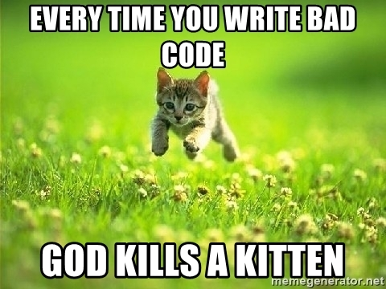

# Functional Programming with JavaScript

Let's have a look at JavaScript from an entirely fresh perspective.

> (Mohammed) Ismail Ansari

## Problems with Software Development (1/2)

A few of the most common problems involved with software development are:

* Complexity
* Structure
* Modularity
* Re-usability

## Problems with Software Development (2/2)

* Concurrency
* Parallelism
* ...more

## Solutions by a few major players (1/6)

### APL (1962)

The syntax of this programming language consists of special graphical symbols, leading to very concise code.

You need a special keyboard to write programs in APL.

They said that APL allowed the developer to focus on the problem rather than the mechanics to solve it.

It is mostly used by companies in the financial sector for mathematical analysis due to its strong support for multi-dimensional arrays.

## Solutions by a few major players (2/6)

### Erlang (1986)

Erlang is a programming language focussed on concurrency.

It is used by:

- Amazon to implement SimpleDB
- Yahoo! to implement Delicious
- Facebook for the backend of Facebook chat
- WhatsApp to run messaging servers
- T-Mobile for SMS and authentication systems
- ...many more

You can read more about where it is used at [this answer on StackOverflow](https://stackoverflow.com/a/1637137/1749585).

## Solutions by a few major players (3/6)

### OCaml (1996)

OCaml is a programming language that combines functional, imperative and object-oriented programming.

Developers do not need to be too familiar with functional programming concepts to be able to write OCaml programs.

It is used by:

- Facebook
- Docker
- Bloomberg
- Citrix

## Solutions by a few major players (4/6)

### Scala (2004)

Scala is a functional programming language that can be made to run on JVM along with Java interoperably.
It is designed to be a scalable programming language.

It is used by:

- LinkedIn
- Twitter
- Foursquare
- Netflix
- Tumblr
- The Guardian
- Sony
- Airbnb
- Apple

## Solutions by a few major players (5/6)

### F# (2005)

F# is a functional programming language combining features of an object-oriented language and can be run as a part of .Net CLI.

It can be written in Visual Studio alongside other Microsoft programming languages.

It can also be used to generate GPU code.

## Solutions by a few major players (6/6)

### C# (2007)

C# has been getting a lot of functional programming features since .Net 3.0.

## What is Functional Programming? (1/3)

> In computer science, functional programming is a programming paradigm - a style of building the structure and elements of computer programs - that treats computation as the evaluation of mathematical functions and avoids changing-state and mutable data. It is a declarative programming paradigm, which means programming is done with expressions or declarations instead of statements. In functional code, the output value of a function depends only on the arguments that are input to the function, so calling a function f twice with the same value for an argument x will produce the same result f(x) each time. Eliminating side effects, i.e. changes in state that do not depend on the function inputs can make it much easier to understand and predict the behavior of a program, which is one of the key motivations for the development of functional programming. - Wikipedia

## What is Functional Programming? (2/3)

* Declarative instead of imperative
* Computations are 'purely' evaluation of (pure) functions
* Function Composition is possible and encouraged
* Avoids state and mutable data - No side effects

## What is Functional Programming? (3/3)

## Declarative vs Imperative programming (1/4)

Problem: Find the sum of odd numbers in the array.

    var numbers = [0, 1, 2, 3, 4, 5];

### Imperative code: Describing 'How to do it' (JavaScript)

    var sumOfOddNumbers = 0;

    for (var i = 0; i < numbers.length; i++) {
    
        if (numbers[i] % 2 == 1) {
            sumOfOddNumbers += numbers[i];
        }
        
    }

## Declarative vs Imperative programming (2/4)

Problem: Find the sum of odd numbers in the array.

    int numbers[] = new int[] {0, 1, 2, 3, 4, 5};

### Imperative code: Describing 'How to do it' (Java)

    int sumOfOddNumbers = 0;

    for(int i = 0; i < numbers.length; i++)
    {
        if(numbers[i] % 2 == 1)
        {
            sumOfOddNumbers += numbers[i];
        }
    }

## Declarative vs Imperative programming (3/4)

Problem: Find the sum of odd numbers in the array.

    var numbers = [0, 1, 2, 3, 4, 5];

### Declarative code: Defining 'What to do' (JavaScript)

    var sumOfOddNumbers = numbers
                          .filter(n => n % 2 == 1)
                          .reduce((a, c) -> a + c, 0);

## Declarative vs Imperative programming (4/4)

Problem: Find the sum of odd numbers in the array.

    int numbers[] = new int[] {0, 1, 2, 3, 4, 5};

### Declarative code: Defining 'What to do' (Java)

    int sumOfOddNumbers = Arrays.stream(numbers)
                          .filter(n -> n % 2 == 1)
                          .reduce(0, (a, c) -> a + c);

## What are Pure functions? (1/3)

> Pure functions are those that provide the same result as the output when supplied with the same inputs, over and over again.

In other words...

> Output of pure functions only depends upon their inputs.

Pure functions make **referential transparency** possible, which is like treating functions as mathematical expressions.

If a function is referentially transparent, its invokation can be replaced by its returned value and the entire expression will still produce the same output.

## What are Pure functions? (2/3)

    var count = 3;

    function addNumber(number) {
      return count + number;
    }

> Not a pure function

## What are Pure functions? (3/3)

    var count = 3;

    function addNumber(count, number) {
      return count + number;
    }

> A pure function

## Functions as First-Class Objects

* They may be named as variables
* They may be passed as arguments to other functions
* They may be returned as results from other functions
* They may be included in data structures

## No Side-Effects!

    i != i + 1

## Side-Effects of Functional Programming

* Eliminates the major source of bugs
* Order of execution is irrelevant
* Makes parallel programming easy
* No burden of prescribing the flow of control
* Referential transparency
* Mathematically tractable programs
* Easier to predict behavior
* Increase in developer productivity

## Is it a new thing?

No, it is not a new thing.

Both, functional programming and functional programming languages have existed for over five decades but object-oriented programming concepts have managed to shape the way programmers think.

## A few popular functional programming languages

* [Haskell](https://www.haskell.org)
* [Scheme](https://en.wikipedia.org/wiki/Scheme_(programming_language))
* [Lisp](https://en.wikipedia.org/wiki/Lisp_(programming_language))
* [Clojure](https://clojure.org) (belongs to Lisp family of programming languages)
* [Scala](https://www.scala-lang.org)
* [F#](http://fsharp.org)

## Some less popular facts about JavaScript

* JavaScript was created on December 4, 1995 (my 8th birthday) by Brendan Eich
* He developed the language in 10 days, after a little over 6 months since Java was created in the same year
* It was originally named as LiveScript and then renamed to JavaScript for better adoption by the mainstream audience
* It is not a lite version of Java
* It is a multi-paradigm programming language
* It can run outside of web-browsers as well
* Can't be trusted with numbers
* Almost everything is 'true' in JavaScript

JavaScript can be used as a functional programming language.

It has been called as "Lisp in C's clothing" by [Douglas Crockford](https://en.wikipedia.org/wiki/Douglas_Crockford).

## Lets write some code...

Time to write some code, one function at a time.

## Passing around functions as data

In functional programming, one can treat functions as data.

This means you could pass functions as arguments to other functions, return them as the return value from other functions, and much more.

A higher-order function (also known as a functional) is a function that does one of the following:

1. Accepts one or more functions as an argument
2. Returns a function as the return value

### Notes

#### Storing functions as values in variables

    var sum = function (a, b) {
      return a + b;
    };
    
    var c = sum(1, 2);
    
    console.log(c);

#### Passing functions to functions

    var double = function (a) {
      return a + a;
    };
    
    var doThatSafely = function (whatToDo, x) {
      try {
        return whatToDo(x);
      } catch (e) {
        console.log(e);
      } finally {
        // Do something here
      }
    }
    
    var c = doThatSafely(double, 2);
    
    console.log(c);

#### Creating functions with functions

    var sum = function (a, b) {
      return a + b;
    };
    
    var createIncrementer = function (i) {
      return function (x) {
        return sum(x, i);
      };
    };
    
    var incrementByOne = createIncrementer(1);
    var incrementByTwo = createIncrementer(2);
    
    var c = incrementByOne(3);
    var d = incrementByTwo(3);
    
    console.log(c, d);

## Transforming an array into another array

Sometimes we need to project one array into another, selecting only the details that we want to.

### Notes

#### Mapping numbers

    var numbers = [1, 2, 3, 4, 5, 6];
    
    // Usual way
    
    var doubledNumbers = [];
    
    for (var i = 0; i < numbers.length; i++) {
      doubledNumbers.push(numbers[i] * 2);
    }
    
    // Better way
    
    var numbers = [1, 2, 3, 4, 5, 6];
    
    var double = function (n) {
      return n + n;
    };
    
    var doubledNumbers = numbers.map(double);
    
    console.log(doubledNumbers);

#### Mapping objects

    var people = [
      {
        name: "Commander Shepard",
        homeworld: "Earth"
      },
      {
        name: "Dr. Liara T'Soni",
        homeworld: "Illium"
      },
      {
        name: "Garrus Vakarian",
        homeword: "Palaven"
      },
      {
        name: "Samara the Justicar",
        homeworld: "Illium"
      },
    ];
    
    var getName = function (person) {
      return person.name;
    };
    
    var names = people.map(getName);
    
    console.log(names);

## Folding (aggregating) an array

Sometimes we need to fold an array into a single value.

A few simple examples could be finding the sum or average of the values in the array.

### Notes

#### Aggregating objects

    var people = [
      {
        name: "Commander Shepard",
        age: 29
      },
      {
        name: "Dr. Liara T'Soni",
        age: 106
      },
      {
        name: "Garrus Vakarian",
        age: 27
      },
      {
        name: "Samara the Justicar",
        age: 430
      }
    ];
    
    // Usual way
    
    var sumOfAges = 0;
    
    for (var i = 0; i < people.length; i++) {
      sumOfAges += people[i].age;
    }
    
    // Better way
    
    var sumOfAges = people.reduce(function (cumulative, person) {
      return cumulative + person.age;
    }, 0);
    
    console.log(sumOfAges);

#### Implementing map using reduce

    var people = [
      {
        name: "Commander Shepard",
        age: 29
      },
      {
        name: "Dr. Liara T'Soni",
        age: 106
      },
      {
        name: "Garrus Vakarian",
        age: 27
      },
      {
        name: "Samara the Justicar",
        age: 430
      }
    ];
    
    var getName = function (person) {
      return person.name;
    };
    
    var myMap = function(source, transformation) {
      var transformAndConcat = function(cumulative, value) {
        return cumulative.concat(transformation(value));
      };
    
      return source.reduce( transformAndConcat, []);
    };
    
    var names_ = myMap(people, getName);

## Searching within an array

Sometimes we need to search for specific values in an array.

### Notes

#### Filtering numbers

    var numbers = [0, 1, 2, 3, 4, 5];
    
    // Usual way
    
    var oddNumbers = [];
    
    for (var i = 0; i < numbers.length; i++) {
      oddNumbers.push(numbers[i] * 2);
    }
    
    // Better way
    
    var isOdd = function (n) {
      return n % 2;
    };
    
    var oddNumbers = numbers.filter(isOdd);
    
    console.log(oddNumbers);

## Chaining multiple operations together

How about chaining multiple operations one after another?

### Notes

    var numbers = [1, 2, 3, 4, 5];

#### Find the sum of even squares

    // The usual way
        
    var sumOfEvenSquares = 0;
    
    for (var i = 0; i < numbers.length; i++) {
      var square = numbers[i] * numbers[i],
        isSquareEven = square % 2 === 0;
    
      if (isSquareEven) {
        sumOfEvenSquares += square;
      }
    }
    
    // The better way
    
    var sumOfEvenSquares = numbers.reduce(function (acc, curr) {
      var square = curr * curr,
        isEven = square % 2 === 0;
    
      return isEven ? acc + square : acc;
    }, 0);
    
    // The chaining way
    
    var square = function (n) { return n * n; };
    var isEven = function (n) { return n % 2 === 0; };
    var sum = function (a, b) { return a + b; };
    
    var sum = numbers.
              map(square).
              filter(isEven).
              reduce(sum, 0);
    
    console.log(sumOfEvenSquares);
    console.log(sum);

## Creating your own universe

Usually, when the execution of a function ends, its scope is 'killed' and it does not exist anymore.

With closures, one can create a scope (universe) what lives even after the function has finished executing.

### Notes

    // This does not work right
    
    var callbacks = [];
    
    for (var i = 0; i < 5; i++) {
      callbacks[i] = function () {
        console.log("This is for", i);
      };
    }
    
    console.log("`i` is now", i);
    
    callbacks.forEach(function (c) {
      c();
    });
    
    // This does work right
    
    var callbacks = [];
    
    for (var i = 0; i < 5; i++) {
      (function (j) {
        callbacks[j] = function () {
          console.log("This is for", j);
        };
      })(i);
    }
    
    console.log("`i` is now", i);
    
    callbacks.forEach(function (c) {
      c();
    });

## Calling one's own yourself

There are certain problems in programming that do not have a straightforward solution.

### Notes

    var tree = [
      1,
      [
        2,
        3
      ],
      4,
      [
        5,
        [
          6,
          7
        ]
      ]
    ];
    
    var sumOfNodes = function (tree) {
       return !tree.length ?
               tree :
               tree.reduce((a, c) => a + sumOfNodes(c), 0);
    };
    
    console.log(sumOfNodes);

## Procrastinating in programs

Sometimes we need to delay the execution of a piece of code at a later point of time or to be executed after some other piece of code has done executing.

### Notes

    // Usual way
    
    var takeCareOfSomeLongRunningTask = function (done) {
      console.log('Started with a long-running process');
    
      // Some long-running task, like determining whether a number is odd
      // or find the sum of an array of numbers
      // or find first 100 prime numbers
      // or find the factorial of 65535
    
      console.log('Done with the long-running process');
    
      var result = 'result';
    
      done(result);
    };
    
    var printResult = function (result) {
      console.log('The result is: ' + result);
    };
    
    takeCareOfSomeLongRunningTask(printResult);
    
    // Better way
    
    var takeCareOfSomeLongRunningTask = function (done) {
      return new Promise(function (resolve, reject) {
        console.log('Started with a long-running process');
    
        setTimeout(function () {
          // Some long-running task, like determining whether a number is odd
          // or find the sum of an array of numbers
          // or find first 100 prime numbers
          // or find the factorial of 65535
    
          console.log('Done with the long-running process');
    
          var result = 'result';
    
          resolve(result);
        }, 5000);
      });
    };
    
    var printResult = function (result) {
      console.log('The result is: ' + result);
    };
    
    takeCareOfSomeLongRunningTask().then(printResult);

## Passing values, one at a time

Usually, all function arguments are passed to a function at the moment of invokation.

Currying allows you to do it one at a time.

### Notes

    var add = function (number) {
      var sum = number;
    
      return function addMore (x) {
        if (x) {
          sum += x;
          return addMore;
        } else {
          return sum;
        }
      };
    };
    
    var add = function (number) {
      return function addMore (x) {
        if (x) {
          number += x;
          return addMore;
        } else {
          return number;
        }
      };
    };
    
    var add = function (number) {
      return function addMore (x) {
        return x ?
          (function () {
            number += x;
            return addMore;
          })() :
          number;
      };
    };

## Challenge!

Using currying, write a function that can create a 'curried' version of (almost) any given function.

### Notes

#### Solution

    var add = function () {
        return Array.prototype.slice.apply(arguments).reduce(function (a, c) {
            return a + c;
        }, 0);
    };
    
    var autoCurry = function (f) {
        var inner = function (previous, current) {
            return current.length ?
                function () {
                    return inner(previous.concat(current), Array.prototype.slice.apply(arguments));
                } :
            f.apply(null, previous);
        };
    
        return function () {
            var args = Array.prototype.slice.apply(arguments);
    
            return args.length ?
                inner([], args) :
                f();
        };
    };
    
    var curriedAdd = autoCurry(add);
    
    console.log(curriedAdd(1, 2, 3)(2, 4)(3)());
