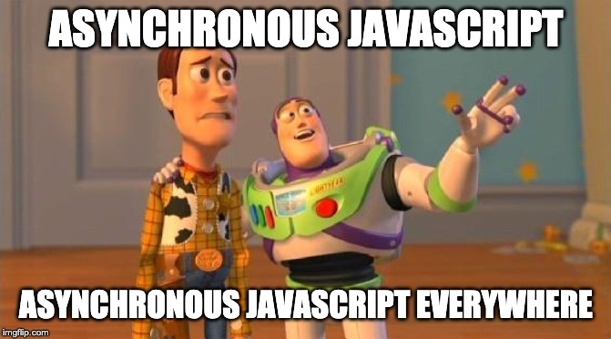

# Asynchronous JavaScript

Let's talk about writing JavaScript in a few different interesting ways.

> (Mohammed) Ismail Ansari

### Notes

To start with, **let me apologize for having a deceiving title** like this. There is a very high probability that **you may not find what you must be expecting** to be in this presentation. To a certain extent, that is intentional as **this presentation does not talk about one particular area** but spans across concepts around writing JavaScript code in a not-so-conventional way.

Secondly, the session will not at all go into details for the paradigms mentioned, but only talk about a few high-level concepts and I'll leave it up to the audience to fill out those gaps if they find it necessary, and importantly if they find those applicable to them.

## Synchronous vs Asynchronous code (1/2)

### Synchronous code

- Begin
- Step 1
- Step 2
- Step 3
- End

### Notes

It is **very easy to read and understand synchronous code**. It's like **a set of instructions executed in a particular order** (usually from top to bottom) in steps where you can move to the next step only once you’re done with the current. That is the way our minds think (at least for most of us), where only one thing is being done at a time.

## Synchronous vs Asynchronous code (2/2)

### Asynchronous code

- Begin
- Step 1 and Step 2 and Step 3
- End

### Notes

When there are **multiple (mostly independent) tasks** to be performed at the same time, the execution becomes asynchronous. Once we lose synchronicity, things quickly get very... well, out of sync. It is almost impossible to predict for what part of the code will be executed at what point of time or what value a particular variable would hold, or whether it will hold a value at all.

## Synchronous nature of JavaScript

JavaScript is a single-threaded programming language.

However, the environment it runs in may be capable of running multiple threads.

### Notes

The **language itself is not capable** of running multiple threads. However, implementations of JavaScript can be made to work asynchronously, using things like an event loop. Every time a new thread has to be started, **a chunk of code gets queued up in the event loop** and gets picked up as soon as the currently executed code reaches an end.

Node.js was advertised to have a **non-blocking IO**, that helps you create web servers serving multiple requests at one time.

By using mechanisms like event loops, web browsers and other platforms like Node.js can help one implement asynchronous behavior.

## Conventional use of JavaScript: Asynchronous in Nature

Just go a few years back. **What was JavaScript primarily used for?**

### Notes

During the early days of JavaScript and until recently, the primary purpose of the language was **to make web pages dynamic**. Most web developers used to write small JavaScript functions for **input validations** and did not consider it as a fully-fledged language that could be used on its own to create something more meaningful.

JavaScript used to be **only executed on user actions**, and the rest of the web page used to be fairly static. The browser used to sit almost idle waiting for user input and almost **every other user action led to a page postback** and the entire context used to be regenerated within the browser.

## Writing Asynchronous JavaScript: Events

I think of **events as asynchronous**.

### Notes

One of the simplest ways to use JavaScript to write asynchronous code is to use events. It can be said that the browser stays idle for the most part unless a control on the web-page that has been bound with an event has been interacted with. As soon as the user interacts with a web control (like entering text in a text box or clicking a button), a JavaScript function bound to the event is triggered and executed.

Obviously, there are so many things that happen between the two, but ignoring all those details (that we would want to ignore), the event handler is called with an object that contains information about the event (like the text entered or the mouse position).

## Writing Asynchronous JavaScript: Callbacks (1/4)

Just to remind ourselves: **JavaScript is a functional programming language.**

### Notes

Callbacks are an **integral part of JavaScript**, in the sense that you can use a callback in your implementation without even realizing that you did. JavaScript **does not require one to use any special syntax** when handling functions as opposed to data. One can use a variable to store a function, one that looks exactly the same as the one that holds a primitive (or even compound) data value. Moreover, you can even use the same variable to hold a value or a function, or even a function that creates functions!

**There are no type declarations** to take care of and that makes this language as fun as it is.

## Writing Asynchronous JavaScript: Callbacks (2/4)

    doThis(result1 => {
        doThat(result1, result2 => {
            nowDoThis(result2, result3 => {
                andNowDoThat(result3, result4 => {
                    andFinallyDoThis(result4, result5 => {
                        var finalResult = transform(result5);

                        console.log('The result is ' + finalResult);
                    });
                });
            });
        });
    });

### Notes

Callbacks **gained popularity (or infamy) with Node.js**, which is a platform that soon got called for a phenomenon called **'callback hell'**.

The above code is a small example of a 'callback hell' which one can end up with if they are not careful while working with asynchronous code and using a lot of callbacks, that too as **anonymous functions**.

As it turns out, this is a feature of JavaScript itself and not something that Node.js introduced.

Node never makes the developer create callbacks within callbacks, within callbacks, it all depends on the way one chooses to write code.

Callback hells make reading and interpreting code very difficult and there are a few different ways one can solve this.

## Writing Asynchronous JavaScript: Callbacks (3/4)

The most basic example of a commonly used callback that comes to one's mind is `setTimeout` and `setInterval`.

    setTimeout(
        () => {
            console.log('Finally executed!');
        },
        5000
    )

### Notes

The first argument to the function call `setTimeout` can be called a callback. It is a function that **gets called from within the function at a later point of time**, which is 5 seconds in this case. A function is not called directly, but is passed to another function as an argument and is called by the child function at a later point of time, **sometimes with a few arguments** with values available at that point of time.

## Writing Asynchronous JavaScript: Callbacks (4/4)

One can also create custom callbacks, take for example the below snippet.

    const logResult = result => {
        console.log(`The result is ${result}`);
    };

    const add = (a, b, onDone) => {
        const sum = a + b;
        
        onDone(sum);
    };

A simple consumption of the above two functions could look like:

    add(2, 3, logResult);

### Notes

As you can see, **callbacks are free**, provided one uses them carefully, without making the code difficult to read.

## Writing Asynchronous JavaScript: Observables (1/3)

Another way of working with asynchronous events is to use **observables**.

    age ---> subscribe ---> n => { greetAnniversary(n); } // Not real code

### Notes

In oversimplified terms, **an observable is a variable that can be tracked for changes** in its value. One can ‘subscribe’ to changes to an observable and perform an operation, something that you can compare to an event handler that is trigger on an event.

There are multiple libraries that provide an implementation of observables. They have their own APIs to create, subscribe and change observables.

## Writing Asynchronous JavaScript: Observables (2/3)

JavaScript does not have native support for observables.

However, there are libraries like [KnockoutJS](https://knockoutjs.com), that one can include in their applications to simulate observables.

    const age = ko.observable(31);

    age.subscribe(
        n => {
            console.log(`You just turned ${n} years old`);
        }
    );

### Notes

KnockoutJS is one of the (or probably the) **oldest implementations to introduce observables in JavaScript**. As we previously talked about, JavaScript does not have a way to treat a variable as an observable, however, Knockout takes an innovative approach to create something of that kind using functions.

I found it so fascinating, I once ended up spinning up a mini-competition at work to try to implement a small part of KnockoutJS on our own. We ended up having a few different implementations. You can find my implementation at [github.com/myTerminal/cute-snippets](https://github.com/myTerminal/cute-snippets/tree/master/observables).

## Writing Asynchronous JavaScript: Observables (3/3)

There's also [Reactive Extensions for JavaScript](https://www.learnrxjs.io) from Microsoft.

    const age = Rx.Observable.create(/* Hidden code */);

    age.subscribe(/* Something */, /* Something */, /* Something */);

### Notes

Another popular (and far more powerful and extensible) implementation of observables was Reactive Extensions (Rx.js). Even though it tries to solve the same problem, Rx.js goes a little further by enabling you to create **event streams** and subscribing to those custom events.

Back in 2013, I worked on an event intensive browser application where we had implemented almost all of our mouse events to use custom events based on event steams around mouse downs, mouse moves, and mouse ups. We also were one of the early adopters of Rx mobile, which extended it further to help with touch events on mobile phones.

## Writing Asynchronous JavaScript: Promises (1/4)

And then there are **promises**.

    doSomething() --> doSomethingElse() --> andFinallyDoThat() // Not real code

### Notes

One relatively modern way of writing (and consuming) asynchronous code is to use Promises.

If you would have used the most popular library to make REST calls, the jQuery, it is very unlikely that you would be unaware of **Promise-like syntax**.

With promises, there is **no chance of callback hell** and moreover, the code is very clean and functional programming like.

A Promise based implementation feels very natural, where your instructions are like **tasks to be performed in steps**, one after the other. It is not very different than reading some synchronous code, but with asynchronicity.

## Writing Asynchronous JavaScript: Promises (2/4)

Fortunately, JavaScript (at least for the relatively recent versions of it) has a native implementation of promises.

    fetchData()
        .then(
            data => {
                return doSomethingWith(data);
            }
        ).then(
            modifiedData => {
                processFurther(modifiedData);
            }
        ).catch(
            e => {
                console.log(`${e} happened`);
            }
        );

### Notes

Unfortunately, **they do not work in all environments**, especially the not-so-smart browsers like even a few recent versions of Internet Explorer. However, there are ways to use those ‘futuristic’ features in the present using **transpilers and polyfills**. Babel is one of the most popular JavaScript transpilers currently used in the community. It seamlessly transpiles new syntax to old syntax, so that it can be understood by those poor browsers, that take years (and sometimes decades) to implement new features.

## Writing Asynchronous JavaScript: Promises (3/4)

Or you can use a library: [Bluebird.js](http://bluebirdjs.com).

    import Promise from 'bluebird';

    const processData = new Promise(
        (resolve, reject) => {
            /*
            A lot of code
            */

            if (result) {
                resolve(result);
            } else {
                reject('Something failed');
            }
        }
    )

### Notes

Bluebird is another implementation to work with Promises, which is **as close to the real standard as possible**. It does not need transpilation and can feel like the real thing with a single import of Promise.

Just like Knockout observables, after having seen that Bluebird.js has a native implementation of promises in JavaScript, I tried a hand on a simplest possible implementation of promise as well at [github.com/myTerminal/cute-snippets](https://github.com/myTerminal/cute-snippets/tree/master/promises).

## Writing Asynchronous JavaScript: Promises (4/4)

Promises can also be consumed synchronously, using a not-so-recent addition to JavaScript, the `async` & `await` keywords.

    const getAndEchoValue = async () => {
        const value = await fetchValueFromThatRemoteSystem();

        console.log(`The value is ${value}`);
    };

### Notes

For the scope of this session, we will not talk about the two keywords here.

## So many ways of writing Asynchronous JavaScript

## Unresponsive Implementations

When the program runs on a single thread, every background task can lead to a potential UI freeze.

### Notes

A website (or a web application) can sometimes feel unresponsive. By ‘unresponsive’, I do not mean a website that has been designed with fixed screen width, but I mean a website or a web application that gets **busy due to a relatively long running task** and stops responding to user actions for a small time.

A few tasks that can make it unresponsive could be a **long-running loop**, **accessing a resource** synchronously or **waiting for user input** through a modal like a browser alert, confirm or prompt action.

Thankfully, (almost) all network calls are implemented in an asynchronous manner, so that is seldom a problem. Long-running loops are something that can be avoided, else a task like that can be delegated to **web-workers**. User input, that thing has quite a lot of options these days so you do not have to use the browser's native features.

How would you make access to browser storage non-blocking?

## Lets take a look at a few browser storage options

First, there were cookies, then came WebSQL and the others followed.

A comparison of the performance of various browser storage technologies and implementations along with a few libraries around them can be compared in this post: [https://nolanlawson.com/2015/09/29/indexeddb-websql-localstorage-what-blocks-the-dom](https://nolanlawson.com/2015/09/29/indexeddb-websql-localstorage-what-blocks-the-dom)

### Notes

Web implementations most frequently used to store data in **cookies**. Some implementations used **WebSQL** and **localStorage** (and sessionStorage) but the former was deprecated in 2010 in favor of a new storage mechanism: **IndexedDB**.

## Accessing browser storage with localStorage (1/4)

`localStorage` (and `sessionStorage`) provides at least two ways to write and read data.

    localStorage.lastName = 'Shepard'; // stores a value 'Shepard' with a key 'lastName';

and

    localStorage.lastName; // reads the value stored against key 'lastName'

OR

    localStorage.setItem('rank', 'N7'); // stores a value 'N7' with a key 'rank'

and

    localStorage.getItem('rank'); // reads the value stored against key 'rank'

### Notes

Data can be accessed as **either a simple object** to set and get values or as an object that has a **setter and getter method** to write and read values respectively.

## Accessing browser storage with localStorage (2/4)

### Advantages

- One of the simplest storage mechanisms to use
- Storage limit greater than cookies, over 5MBs as opposed to 4KBs
- Stored data stays with the domain

## Accessing browser storage with localStorage (3/4)

### Disadvantages

- Store and retrieve operations are synchronous
- All data is stored as a string
- The storage limit is 5MBs for most browsers, which can be limiting
- It is not known to be secure
- No provision to create expiring data as with cookies, the data may last forever

## Accessing browser storage with localStorage (4/4)

### Amplify.js is a great option

A few of the many features it provides are:

- Multiple storage types besides localStorage
- Stored data can be set to expire after a set time

### Notes

There are libraries available to provide features on top of `localStorage`. One that I used in a previous project of mine is [Amplify.js](https://amplifyjs.com).

## Accessing browser storage with IndexedDB (1/3)

IndexedDB was supposed to replace WebSQL and to a certain extent, `localStorage` and `sessionStorage` as well.

Data is not stored as key-value pairs but as a table.

### Notes

With that different way of storing data, one can do **queries**, make **joins**, create **indexes**, and most importantly, store **data apart from strings** as well, which can also include dates, object & array instances, etc.

However, the **API is not that simple to use** and needs a lot of work to even store and retrieve a single value as all data access is transactional.

## Accessing browser storage with IndexedDB (2/3)

### Advantages

- Asynchronous data access is possible
- Storing of data apart from strings is possible
- Provides richer data management features
- It is more secure than `localStorage` and `sessionStorage`

## Accessing browser storage with IndexedDB (3/3)

### Disadvantages

- There is a lot of work before you can store or retrieve even a single value

## Meet `localForage` (1/2)

`localForage` is a fast and simple library to work with browser storage. It provides a wrapper over IndexedDB, WebSQL, and `localStorage` and helps you work with browser storage using an API that feels as simple as localStorage.

### Notes

The **code stays asynchronous**, regardless of the storage technology one uses, **without the overhead of learning a different API**.

## Meet `localForage` (2/2)

### Advantages

- No UI Blocking, as the code that accesses the browser storage is asynchronous
- The code looks very clean
- One can choose to use either callbacks or promises, according to one's preference/style/requirement
- Data stored on `localStorage` and `sessionStorage` can also be something besides a string!
- There are plugins to add features like `sessionStorage`

## References

- [Is IndexedDB the Ultimate Client-side Storage Option? | Toptal](https://www.toptal.com/web/persisting-data-page-reloads-cookies-indexeddb)
- [Using IndexedDB - MDN web docs](https://developer.mozilla.org/en-US/docs/Web/API/IndexedDB_API/Using_IndexedDB)
- [How To Use IndexedDB - Simple(st) Example](https://greenido.wordpress.com/2012/10/05/how-to-use-indexeddb-simplest-example)
