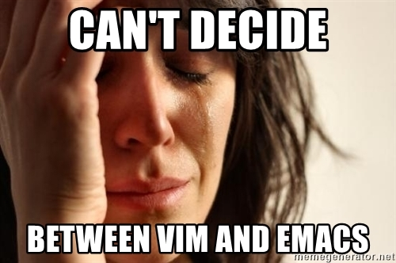
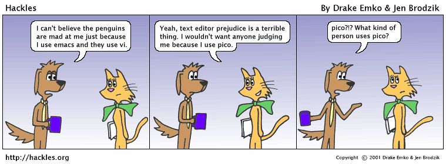
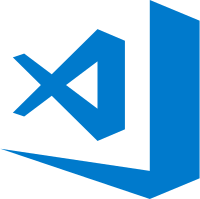

# Why use Emacs in 2017

This session will try to answer the below questions:

1. Why is Emacs still worth talking about in 2017 (and beyond)?
2. How can one use Emacs at work (and outside, if that applies to them) to make their day-to-day tasks easier and faster?

## Disclaimer

> This is **NOT** a work of fiction. Names, dates, places, events, incidents, text-editors and programming languages mentioned in this session actually exist in the world outside this room. All resemblance to actual persons, living or dead, or actual events, are intentional.

## What this session can cause

## Or may be...

Image source: [http://hackles.org/strips/cartoon93.png](http://hackles.org/strips/cartoon93.png)

## ...Or even worse

Image source: [https://imgs.xkcd.com/comics/real_programmers.png](https://imgs.xkcd.com/comics/real_programmers.png)

## A Brief Background

Let's start with a definition:

> Emacs is a family of text editors that are characterized by their extensibility. - Wikipedia

And another one just in case:

> Emacs is the extensible, customizable, self-documenting real-time display editor. - Emacs Manual

Emacs is a 'text-editor' that was created by [David A. Moon](https://en.wikipedia.org/wiki/David_A._Moon) and [Guy L. Steele Jr.](https://en.wikipedia.org/wiki/Guy_L._Steele_Jr.) in 1976.

There are various forms of Emacs, the most popular, most ported and most relevant form is [GNU Emacs](https://www.gnu.org/software/emacs) created by [Richard Stallman](https://en.wikipedia.org/wiki/Richard_Stallman).

## Why Use Emacs Today?

It has been 41 years since Emacs was first introduced.

Hence, we are talking about software that has an age more than most people (or probably everyone) in this room.

The runtime of Emacs is based on a functional programming language called Emacs Lisp (Elisp for short).

Elisp is one of many languages in a family of functional programming languages called [Lisp](https://en.wikipedia.org/wiki/Lisp_(programming_language)) which was created back in 1958 by [John McCarthy](https://en.wikipedia.org/wiki/John_McCarthy_(computer_scientist)).

### Notes

These things are really old. There should to be a reason to keep those things around, shouldn't it?

## Why Emacs: It's extensively extensible

* Emacs is a software that can be programmed to do so many things.

* It's very easy to add new features to it and if you're feeling lazy to learn Lisp, you can rely on other users who write extensions every day and put it up there for you to use, for free!

* The Emacs community has plenty of dedicated people who create extensions and maintain them, just for you.

* A personalized Emacs does not look anyway near to stock Emacs and can be made to behave exactly according to one's needs.

* The same way, it is very likely that two Emacs configurations will be very different from each other.

* For the lazy ones amongst us, there are various starter kits available to use so you do not have to spend time configuring it.

## Why Emacs: It's available on all major operating platforms

Emacs will never leave you.

It is available on Linux, Macintosh, and Windows.

Apart from being there everywhere, your customization, the extensions that you install, everything can be made to travel with you.

People share their Emacs configuration on GitHub as a public project to help others learn or maybe just to show off how cool 'their' Emacs is.

## Why Emacs: It has a mode to do everything

Emacs is a mode based application (or text editor).

An oversimplified explaination would be that it uses a mode for everything you do within it.

To edit JavaScript, there's a *javascript-mode*,

For managing your to-dos and appointments there's an *org-mode*,

While viewing a document you would be in *doc-view-mode*.

There is a mode for almost everything, and if there isn't a mode for something that you want to do, it's not so difficult to create one yourself.

## Why Emacs: It's not just a text editor

They say that Emacs is an operating system with Linux as its device drivers.

If you would have ever wished to be able to run shell commands from within your text-editor without having to switch to a command line window, especially before the VS Code dominated days, it was possible to do that within Emacs.

You can browse the internet, send emails and even play games from within Emacs.

It can be said that Emacs is a platform based on Lisp runtime.

Emacs has its own package manager. You can add package repositories to be able to install/update/remove extensions interactively.

Also, some of this stuff is built-in so you still have access to a great bunch of software without even adding additional repositories.

## Why Emacs: It has survived for so many decades

Emacs is one of the two oldest text-editors that are useable today.

It survived for so long and that sort of proves some point there.

## Why Emacs: It's a source of inspiration

There's a term *editor wars* for whether to use Emacs or Vim.

It is said that it doesn't matter whether you choose Emacs or Vim, but you should choose one, at least for some time.

Even with the fact that Emacs will indoctrinate you to use it everywhere and in every possible way, it is not necessary that you should.

But it can be suggested that you should at least try it out so that you could go back to your favorite text-editor and be more efficient in what you do by probably looking for a few of those cool features or who knows, may be implementing a few?

## Why Emacs: It's a cult

Emacs has a strong community of developers who would love to help you get started, pull you out of trouble when you get stuck and write extensions for free.

[Perry E. Metzger](https://twitter.com/perrymetzger), a very senior Emacs user has called it *The Editor of a Lifetime* at an Emacs meetup in New York in August 2014 where he stated that he had been using Emacs for 31 years back then.

You can view a recording [here](http://www.youtube.com/watch?v=VADudzQGvU8) or you could view the slides [here](http://emacsnyc.org/assets/documents/emacs-the-editor-of-a-lifetime.pdf).

## My Configuration

Let's have a look at how Emacs helps me at work...

### Notes

There goes some live demo with a little information and a lot of showoffs.

## The World Of Emacs

I started with a stock Emacs somewhere in 2013, wrote some customization, shared [my dotfiles on GitHub](https://github.com/myTerminal/dotfiles/tree/master/.emacs.d) and ended up publishing [several packages of my own](https://marmalade-repo.org/profile/myTerminal).

It has been a great learning experience throughout and hopefully it will still continue.

I use it at (and outside of) work every day and it turns out to be my most used software on my computers.

I created a few YouTube videos about emacs and recently published a detailed learning guide for newbies to Emacs. I call it the [World of Emacs](https://github.com/myTerminal/world-of-emacs).

## Conclusion

* Emacs is not just a myth and it still exists.
* Even though it looks like it was created for the stone-age, it's still a useable text-editor.
* Emacs may seem to be as hard as rocket-science at the start but spending a few weeks with it can not only change that, it can potentially change you as a user.

## "But I like Visual Studio Code..."

### Notes

That's Ok. If you just learn a little about the text-editor that you use frequently, you should be good.

At the end of the day, what tools you use do not matter so much, the way you use them does.

